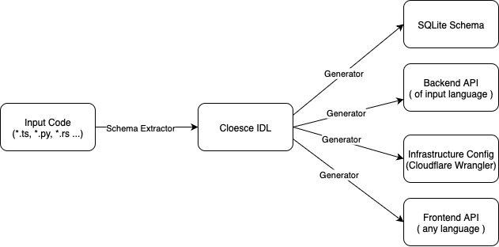

# Cloesce Abstract

## Problem Statement

Web development (being, development utilizing an HTTP server) is full of repetitive, boilerplate code. To create a simple CRUD application, a developer would need to:

1. Create a database schema
2. Create CRUD API endpoints for their database tables
3. Fill those API endpoints with basic CRUD SQL calls
4. Create a frontend API capable of calling those API endpoints
5. Host this on some relevant infrastructure (as of 2025, a cloud provider such as Cloudflare or AWS)

A consumer facing CRUD application would also need authentication, likely through fine grained role-based permissions.

This elaborate process, spanning several files across hundreds of lines of code to create what a consumer would see as a trivial application has improved over time. Instead of seeing these five criterion as entirely seperate entities, new paradigms and libraries released with the objective of doing more with less. Notably, these are:

- [Swagger](https://swagger.io/docs/)
- [gRPC](https://grpc.io/docs/) or [Cap'n Proto](https://capnproto.org)
- [GraphQL](https://graphql.org)
- [IntelliTect's Coalesce](https://intellitect.github.io/Coalesce/)

Swagger defines a contract generated from the backend API endpoints, such that the frontend can have a simple interface to call these methods (without manually writing out endpoints). Importantly, Swagger will also copy models from the backend to the frontend, so developers do not need to redefine types.

RPC calls (in the context of web development) have the goal of creating a unified API for both the backend and the frontend: from a user specified interface (or prototype), the backend will implement the interface, and the frontend consist of a network call to hit this endpoint. Unlike Swagger, RPC aims to do this transparently-- the developer should not know that this call induces a network request. Typically, RPC communicates over their own more efficient channels not suited for basic REST calls.

GraphQL adds another step, unifying the database, backend, and frontend (by almost eliminating the backend), allowing the business logic to sit on the frontend. However, GraphQL has [several flaws](https://l-lin.github.io/web/drawbacks-of-GraphQL) and has generally fallen out of use in the web development community.

Finally, IntelliTect's Coalesce unites the database, backend, and frontend utilizing [Microsoft's Entity Framework](https://learn.microsoft.com/en-us/ef/). A developer needs only to define a C# model, which can then be generated into a SQL database, a backend REST API, a frontend API, and also frontend Vue.js components to easily interact with the service. The paradigms Coalesce uses will be critical in designing Cloesce (Cloesce is named after Coalsece: Cloudflare + Coalesce = Cloesce).

However, none of these technologies are natively capable of covering all web development criterion: database, backend, frontend, and cloud infrastructure. While Coalesce gets close, it does so relying on .NET, and TypeScript, while all other methods provide more of an specification that is language agnostic.

Cloesce aims to operate across all domains of web development transparently, agnostic of language.

## Introduce Cloesce

Let's now imagine we have a framework capable of generating all relevant of a web development project including cloud infrastructure from individual models (much like how RPC defines a shared interface). Cloesce aims to do this natively from your code: be it in TypeScript, Python, Rust, etc. What would the developer gain?

We aim to create transparency: the developer writes a simple class (model). From the developers perspective, it isn't obvious this model also creates a database schema, a REST API, and so on. Cloesce utilizes the same transparency RPC achieves. Continuing with this transparency, a developer should not need to think of the final cloud environment a model lives on as a seperate entity, but only decide how that model should be called (be it through a serverless lambda, or a long lived container). From the perspective of the frontend, the developer should be able to call the exact same model as if it exists on it's own machine, regardless of the original language we defined the model in, because those methods will exist as a network call.
With this, Cloesce enables a _model first_ programming paradigm-- a central area of business logic that dictates the system design of an application.

Another important gain of this paradigm is security. Every time a developer has to write their own boilerplate, or glue together different domains, they risk introducing vulnerabilities into the system. If the majority of this can be deterministically generated, the security can be verified from the compiler.

Finally, in the age of LLM's producing most of our code, we should ask: what do I want the LLM to spend it's time doing? Spinning up the latest OpenAI model and asking it to "make me a full stack TODO app deployed on the cloud" is almost sure to fail, because the task is far too general. The LLM would need to decide on the languages and frameworks, as well as the cloud provider. Because of this, the query would burn through tokens, and likely requery itself a number of times before arriving at some final output after some time. An LLM would benefit the same way developers would from a central area for logic-- all it needs to do is write a model, run a generate command, and make a pretty frontend.

## Cloesce Compiler

Cloesce is a compiler: given a programing language as input, extract an agreed upon Interface Definition Language (or IDL), and then feed that a the code generator process, finally outputting:

- A SQLite schema representing structure and fields of the models
- A Backend REST API via Cloudflare Workers in the original language
- An Swagger-like frontend API in any supported language
- A Cloudflare Wrangler configuration file



A pseudo-code example of a Cloesce Model:
```typescript
@D1
class Person {
    id: number;
    name: string;
    age: number;

    @R2(bucket="images")
    image: R2Id;

    @Workers.GET
    async foo(db: D1Db) {...}
}
```


### Cloudflare

Cloudflare provides the ideal cloud infrastructure ecosystem for Cloesce to take advantage of. From a [single configuration file](https://developers.cloudflare.com/workers/wrangler/), we can spin up a both a local development environment, and a cloud deployed environment. Cloesce aims to use the full capacity of Cloudflares developer platform, mainly:

- [Workers](https://developers.cloudflare.com/workers/) for serverless REST API calls
- [D1](https://developers.cloudflare.com/d1/) for SQLite databases
- [R2](https://developers.cloudflare.com/r2/) for object storage
- [Durable Objects](https://developers.cloudflare.com/durable-objects/) for stateful models
