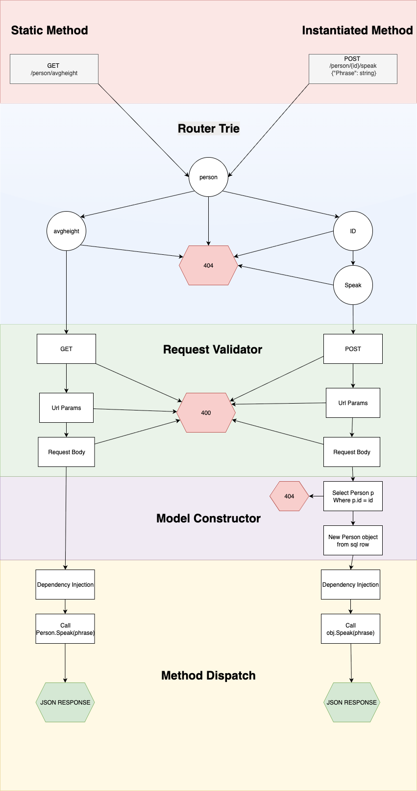

# Thoughts on v0.0.1 API Generation

## IDL Definition

```typescript
@D1
class Person {
  @PrimaryKey
  id: number;
  name: string;
  height: number;

  @POST
  async speak(db: D1Db, req: Request, phrase: string) {
    // ...
  }

  @POST
  static async avgHeight(db: D1Db, req: Request) {
    // ...
  }
}
```

## Architecture

The API generator takes the IDL as input and parses into a state machine.



The processing pipeline begins with method classification, distinguishing between static class methods and instance methods that require object instantiation. Subsequently, a trie-based routing mechanism efficiently resolves incoming requests to their corresponding method handlers. Routes that fail to match existing endpoints trigger an early termination with an HTTP 404 response.

Successfully routed requests proceed to the validation stage, where request parameters, HTTP methods, and payload schemas are verified. For instance methods, the system performs model instantiation and data hydration from the underlying data source. Static methods bypass this step entirely to optimize performance.

The final stage employs dependency injection to provide the resolved method with all required runtime dependencies, including database connections, request objects, and validated parameters. Execution then transfers control to the user-defined business logic, which returns the appropriate HTTP response.

The entire serverless function codebase is generated programmatically through a builder pattern implementation, ensuring consistent structure and maintainability.

## Builder Interface Sudo Code

```typescript
interface WorkersApiBuilder {
  build(): File;
}

class TsWorkersApiBuilder implements WorkersApiBuilder {
  build(): File {
    return // generated file
  }
}

enum TrieNode {
  Id({ value: number, transitions: Map<string, TrieNode> }),
  Method({ name: string, transitions: Map<string, TrieNode> })
}
```

## Fluent API

```typescript
new TsWorkersApiBuilder()
  // router
  .router("Person")                     // /person
  .transition([
    TrieNode.Id()                       // /person/:id
      .transition([
        TrieNode.Method("speak")        // /person/:id/speak
          // Function configuration
          .validate(Validator.HttpVerb(HttpVerb.POST))
          .validator(Validator.UrlParam("id"))
          .validator(Validator.Body(body, type))
          .sql(Sql.GetById("id"))
          .model<Person>()
          .dependency<D1Db, Request>()
          .dispatch("speak")
      ]),
    
    TrieNode.Method("avgHeight")        // /person/avgHeight
      .validate(Validator.HttpVerb(HttpVerb.POST))
      .dependency<D1Db, Request>()
      .dispatch("avgHeight")
  ])
  .build()
```

## Generated Code

```typescript
// GENERATED CODE
export default {
  async fetch(request: Request, env: Env, ctx: ExecutionContext): Promise<Response> {
    const router = // generated => Map { Map { Map: function }}
    
    const pathSegments = new URL(request.url).pathname.split('/').filter(Boolean);
    const func = router[pathSegments[0]]?.[pathSegments[1]]?.[pathSegments[2]]; // api/model/id etc
    
    if (!func) {
      return new Response('Not Found', { status: 404 });
    }
    
    return func(request, env, ctx);
  }
} satisfies ExportedHandler<Env>;
```