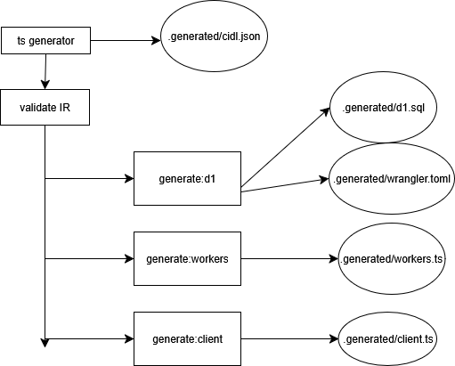

# NPM Orchestration

So for npm orchestration, there's a few design philosophies that are pivotal before we can even consider what kind of technology we're going to use

## Design Philosophies

### 1) Reproducible and hermetic
Reproducible is a given since Cloesce's output is deterministic. What we really need to implement is making sure npm orchestration is hermetic. Builds shouldn't depend on the host machine's quirks and no matter what OS, PATH variables, global installs, when we install the package on a random device, ideally everything should behave the same.

### 2) Cross-platform
Goes hand in hand with 1, it should work across macOS/Linux/Windows without any weird shell quirks

### 3) Speed
We should aim for orchestration to be reasonably fast. Usually npm packages will cache things like configuration flags, model files if not changed, things like that so after the first run the npm command will run significantly faster, and since one of the big use cases for Cloesce is to advance vibe coding beyond just localhost, I assume users will be running cloesce over and over.

### 4) Clear lifecycle
Multiple stages of execution, I'll go more into this later when hashing out how we want to design orchestration

### 5) Strong failure semantics
If we want to run Cloesce with one command such that with a single TS model file, we output wrangler files ready to be deployed. To do this without it being a bad experience, we need to have Cloesce fail fast with actionable errors, they should at least point the user to the right direction. There's multiple fail points that can happen with Cloesce (json generation, d1/wrangler generation, client generation, migrations) so we need to make sure that errors are verbose enough such that if something fails, the user should be able to diagnose and fix the issue in their TS model file.

### 6) Excellent DX
Potential verbose commands for logging, progress bars, `Cloesce doctor` maybe to verify the ts model file before running anything

---

With these design philosophies, we can go ahead and actually plan out how we want to handle npm orchestration.

## Commands and Architecture

The first thing I want to cover is commands. Ideally we run `cloesce run` and everything is generated, all the user has to do is `wrangler run dev`

But what goes under the hood? First thing I want to make clear is that npm should not just be a underlying bash script. We should treat the build as a dataflow, not a bunch of shell commands. **Essentially we need to build a directed acyclic graph since most good npm packages use frameworks or have their own systems that do this.** Each step (TS to IR, IR to workers.ts, IR to SQL, Wrangler build, etc.) is a task node which consumes inputs and produces outputs. So the edges say "the output of this task node will feed into the next task", and when we rebuild we can detect what the user changed, find only the tasks downstream that need to be rerun, and rebuild the minimal set. This means that things will be way faster when we rebuild, we can run things via parallelism if we want to (we can generate workers AND d1 at the same time), and we have observability into what changed for logging purposes.

## Implementation

> **Note:** There's **tooling frameworks that might just do all this for us like Nx** so we don't have to deal with all this set up and caching that I might just go with for the sake of simplicity. This just describes iff we want to go down the path of building from the ground up for whatever reason. If the frameworks that are avaliable aren't enough and we need to build this from the ground up, I can see pretty easily getting bogged down here, so as a first goal I want to just first just get everything to run in order correctly. Then I'll move onto implementing the DAG so we can run everything in parallel and reduce runtime (It might seem unnecessary to set up DAG here since there's easier ways to get the same result, but the DAG is critical for caching and faster rebuilds moving forward), then move onto caching builds for quick rebuilds.

Implementation wise, we need to make sure each run behaves the same and reads one source of truth, every file should be generated into the same `.generated/` file. Then we need to do content hashing and env fingerprints, meaning we read the bytes of important files like the TS models and hash them. This ensures that when we rebuild and the hash is the same, we can quickly keep going and build since we know nothing has changed. Then we formalize each build step as a worker with a clear contract, as in each step should have dependencies that must be completed before we run anything, what counts as inputs, the output it promises to write, and how we run everything. Then we build the DAG and do topological sort, we build the dependency graph from the registry and compute a safe execution order, skipping cache hits and executing everything in one go.

## Making it Hermetic

Ok so now we know how to graph out orchestration and what tools/data structures we can use to make this all work. But how do we make it hermetic?

Before we go into the gritty details, we should define some context. npm packages run different languages (like our rust compiler) via a binary, which is just a compiled program packaged into a single file like a .exe. The binary is precompiled and runs super fast, you get the idea.

### The Unified Binary Solution

So how do we have a unified binary then? We quickly run into issues for the average user when we consider that they might not have Rust installed, and different OS and CPU combos can create weird execution with binaries, overall does not sound fun to implement and test. This is where **WebAssembly, or WASM** comes in. WASM gives us a portable, precompiled binary that runs on any platform inside a Node process. So we can just compile the Rust generator into a `.wasm` file, then Node will run it via JS wrapper within the npm package, and boom, we have complete coverage over every OS and CPU. Now if a user wants to develop Tinder for Horses on Yocto Linux running on secret technology forbidden Uzbekistani 128 bit CPU architecture, they can do so and we don't have to test and fix random edge cases. Overall the set up seems pretty easy, just need to compile the rust generator on wasm and we're good to go, our JS wrapper will handle the rest. 

And that's orchestration in a nutshell. 