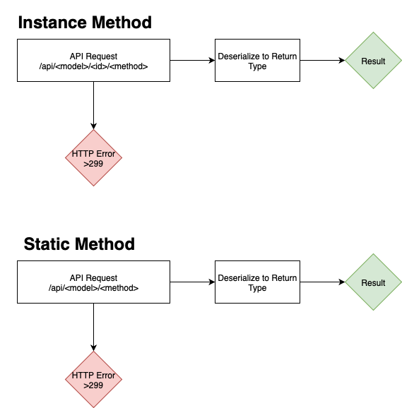

# Thoughts on v0.0.1 API Client

Given the model:

```typescript
@D1
class Person {
    @PrimaryKey
    id: number;
    name: String,

    @GET
    say_name(): Response<String> {...}

    @GET
    static say_all_names(d1: D1): Response<String> {...}
}
```

we would extract the following CIDL:

```json
{
    .
    .
    .
  "language": "TypeScript",
  "models": [
    {
      "name": "Person",
      "attributes": [
        ...
      ],
      "methods": [
        {
          "name": "say_name",
          "is_static": false,
          "http_verb": "Get",
          "parameters": []
        },
                {
          "name": "say_all_names",
          "is_static": true,
          "http_verb": "Get",
          "parameters": [
            {
                "name": "d1",
                "type": "D1",
                "nullable": false
            }
          ]
        }
      ]
    }
  ]
}
```

So, what would the client API look like? We will take after the RPC paradigm, a shared identical interface (nearly) transparent to different devices. On the client however, the implementation of a method will be replaced by an async request to the backend. Roughly, in typescript, the generated code could look as:

```typescript
class Person {
    id: number;
    name: String,

    async say_name(): Promise<String> {
        // fetch
        ...
    }

    async static say_all_names(): Promise<String> {
        // fetch
        ...
    }
}
```

Note that the schema extractor defintions can be left off, as well as backend specific types such as `D1`. The method result types can be simplified as well, returning only the intended response and dropping the REST API related responses.

The implementation of `say_name` or `say_all_names` could yield an error result instead of the intended result, such as`404`. Two approaches to handle this come to mind:

1. Use a Monad, return a `Promise<Result<String>>` which could be an error type or a result, both containing their HTTP codes
2. Use try/catch, returning a `Promise<String>` but escaping via throwing an exception

RPC frameworks like gRPC use the try/catch method, but there is a growing respect for monad results (which I personally prefer). The only problem I could see from the monad approach is the extra code we would have to generate, which would also require a sophisticated type system, like:

```typescript
type Ok<T> = { ok: true; data: T };
type Err = { ok: false; status: number; message: string };
type Result<T> = Ok<T> | Err;

// ...model =>
async say_name(): Promise<Result<String>> {
    ...
}

// ...frontend =>
if (result.ok) {
    console.log("Name:", result.data);
} else {
    console.error(`Error ${result.status}: ${result.message}`);
}
```

or in Python

```python
from dataclasses import dataclass
from typing import Generic, TypeVar, Union

T = TypeVar("T")

@dataclass
class Ok(Generic[T]):
    ok: bool = True
    data: T = None

@dataclass
class Err:
    ok: bool = False
    status: int = 500
    message: str = "Unknown error"

Result = Union[Ok[T], Err]


# ...code somewhere
match result:
    case Ok(data=name):
        ...
    case Err(status=code, message=msg):
        ...
```

Looking at the [supported languages for Cloudflare workers](https://developers.cloudflare.com/workers/languages/), it seems like they would all be capable of a `Result` monad.

To make good use of `Result`, several declarative methods would need to be built on to it, like `.map` or `.and_then`, which would make code generation more sophisticated. `Result` forces the developer to handle bad states, and knowing that the majority of Cloesce developers would be generating their frontend with an LLM, this approach would force that the LLM takes errors into account or explicitly ignore it (rather than "implicitly ignoring" it by not using a try/catch block).

## Request State Machine



## Generator

The code to generate an API in language $L$ would be relatively simple:

1. Input a Model (from CIDL)
2. For each method of the model, generate the above state machine in language $L$
3. Output the Model
4. Repeat for all models
5. Add Result type to output in language $L$

An example output could be:

```typescript
type Ok<T> = { ok: true; data: T };
type Err = { ok: false; status: number; message: string };
type Result<T> = Ok<T> | Err;

class Person {
    id: number;
    name: String,

    async say_name(): Promise<Result<String>> {
        const res = await fetch(`/api/Person/${this.id}/say_name`);
        if (!res.ok) {
            return { ok: false, status: res.status, message: res.statusText };
        }
        const data = (await res.json()) as { name: string };
        return { ok: true, data: data.name };
    }

    async static say_all_names(): Promise<Result<String>> {
        const res = await fetch(`/api/Person/say_all_names`);
        if (!res.ok) {
            return { ok: false, status: res.status, message: res.statusText };
        }
        const data = (await res.json()) as { names: string };
        return { ok: true, data: data.names };
    }
}
```

An interesting approach to this would to be using file templating, with [handlebars](https://github.com/sunng87/handlebars-rust) for example. All we would have to do is load the language template and utilize the handlebars library. It would be important to link the templates to the actual binary instead of reading a file.

## Notes

In `v0.0.1` we aren't adding the functionality of the backend returning a Model type, like

```typescript
// ...model =>
static list(d1: D1): Response<Person[]> {...}
```

so the frontend will only really be capable of static method calls. Later, we will add this functionality, as well as the ability to completely generate CRUD boilerplate endpoints like get, list, post, patch, delete, etc, allowing the frontend to easily fetch instantiated models.
