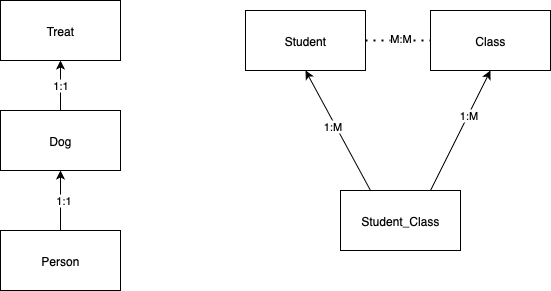

# Thoughts on v0.0.2 Foreign Keys

---

## Naive World View

Let's consider the types of FK relationships using simple object composition

**(1:1)** Person has a Dog

```ts
class Dog {
  id: number;
}

class Person {
  id: number;
  dog: Dog; // | null
}
```

**(1:M, M:1)** A person has many dogs, many dogs have one person. In SQL, this relationship is shown backwards: a dog has a foreign key to a Person

```ts
class Person {
  id: number;
  dogs: Dog[];
}

class Dog {
  id: number;
}
```

**(M:M)** A student has many classes, a class has many students

```ts
class Student {
  id: number;
  classes: Class[];
}

class Class {
  id: number;
  students: Students[];
}
```

---

## Problems with naive view

As talked about [here](thoughts_sql_v0.0.1.md), the previous design has some drawbacks, caused by cartesian explosion and recursive definitions.

- Performance issues
- Cost issues (D1 is charged by [rows read, written](https://developers.cloudflare.com/d1/platform/pricing/#:~:text=D1%20bills%20based%20on%3A,are%20not%20billed%20for%20compute.))

### Rercursive Definitions, Cartesian Explosion

Let's use our M:M example of Students to Classes. Assume I want to hydrate a student model from the database (represent as JSON):

```json
{
  "students": [
    {
      "name": "Student0",
      "classes": [
        {
          "name": "Class0",
          "students": [
            {
              "name": "Student1",
              "classes": [
                {
                  "name": "Class0"
                  ...
                }
              ]
            }
          ]
        }
      ]
    }
  ]
}
```

This is an example of a recursive definition.

A cartesian explosion can be modeled:

```sql
SELECT
    s.Name AS StudentName,
    c.Name AS ClassName,
    t.Title AS TextbookTitle
FROM Students s
LEFT JOIN Enrollments e ON s.Id = e.StudentId
LEFT JOIN Classes c ON e.ClassId = c.Id
LEFT JOIN ClassTextbooks ct ON c.Id = ct.ClassId
LEFT JOIN Textbooks t ON ct.TextbookId = t.Id
ORDER BY s.Name, c.Name, t.Title;
```

Assuming a student is enrolled in 2 classes, and each class has 3 textbooks, a single query would return 6 rows and have to be deduped. See [single vs split queries](https://learn.microsoft.com/en-us/ef/core/querying/single-split-queries) for the Entity Framework solution.

### Data Source Solution

GraphQL and Entity Framework solve this dependency problem in a similiar way, using a tree data structure.
For the many to many example, GraphQL would make you specify the exact structure of the query:

```
query {
  students {
    id
    classes {
      id
      students {
        id
      }
    }
  }
}
```

Entity Framework does something similiar using it's Fluent API pattern. Note it only cares about FK's.

```c#
var students = db.Students
    .Include(s => s.Classes)
        .ThenInclude(c => c.Students)
    .ToList();

```

Coalesce tackles this issue using the concept of a ["Data Source"](https://intellitect.github.io/Coalesce/concepts/include-tree.html). By default, Coalesce will only look at a models direct neighbors (in data hydration). However, you can customize many sources, all of which are serialized to the frontend:

```c#
public class Person
{
    [DefaultDataSource]
    public class IncludeFamily : StandardDataSource<Person, AppDbContext>
    {
        public IncludeFamily(CrudContext<AppDbContext> context) : base(context) { }

        public override IQueryable<Person> GetQuery(IDataSourceParameters parameters)
            => Db.People
            .Where(f => User.IsInRole("Admin") || f.CreatedById == User.GetUserId())
            .Include(f => f.Parents).ThenInclude(s => s.Parents)
            .Include(f => f.Cousins).ThenInclude(s => s.Parents);
    }
}

[Coalesce]
public class NamesStartingWithA : StandardDataSource<Person, AppDbContext>
{
    public NamesStartingWithA(CrudContext<AppDbContext> context) : base(context) { }

    public override IQueryable<Person> GetQuery(IDataSourceParameters parameters)
        => Db.People.Include(f => f.Siblings).Where(f => f.FirstName.StartsWith("A"));
}
```

Note that the data source is only applied in Coalesce generated endpoints, if someone just did `Db.Persons...` it wouldn't magically apply there.

If we are to take inspiration from Coalesce, it will be important to make an `Include` function of our own. Note we can't make nice filters like `NamesStartingWithA`, because Cloesce _currently_ lacks an ORM (we may try to make one in the future...) so we will be closer to GraphQL syntax (while only caring about FK's)

```ts
type IncludeTree<T> = {
     // Really the only time TypeScript has been nice, I assume this won't be quite as easy
     // in other languages
    [K in keyof T]?: T[K] extends ClassType ? IncludeTree<T[K]> : never;
};

class Treat {}

class Dog {
  treat: Treat;
}

class Cat {}

class Person {
  id: number;
  dog: Dog | undefined; //  | null
  cat: Cat | undefined; //  | null

  @DataSource("default")
  readonly default: IncludeTree<Person> = {
    dog: { bone: {} },
    cat: {},
  };

  @DataSource("noCats")
  readonly noCats: IncludeTree<Person> = {
    dog: { bone: {} },
  };

  @DataSource("nothin")
  readonly nothin: IncludeTree<Person> = {};

  async animals(): Person {
    return {
        this.dog,
        this.cat
    }
  }
}

//... frontend
let person = ...
await person.animals()                      // => {dog: { treat: {} }, cat: {} }
await person.animals(DataSources.noCats)    // => {dog: { treat: {} } }
await person.animals(DataSources.nothin)    // => {}
```

---

## Generation

Let's finally talk code generation. In order to make this work, we will need to introduce some new types: Data Sources, Foreign Keys, and Many to Many relationships

```ts
class Student {
  @PrimaryKey
  id: number;

  @ManyToMany
  classes: Class[];
}

class Class {
  @PrimaryKey
  id: number;

  @ManyToMany
  students: Students[];
}

class Treat {
  @PrimaryKey
  id: number;
}

class Dog {
  @PrimaryKey
  id: number;

  @ForeignKey
  treat: Treat;
}

class Person {
  @PrimaryKey
  id: number;

  @ForeignKey
  dogId: number;
  dog: Dog | undefined;

  @DataSource("default")
  readonly default: IncludeTree<Person> = {
    dog: { treat: {} },
  };
}
```

creating the CIDL

```json
{
  "models": [
    {
      "name": "Person",
      "attributes": [
        // ...
        {
          "foreign_key": {
            "OneToOne": "Dog"
          },
          "value": {
            "cidl_type": "Integer",
            "name": "dogId",
            "nullable": false
          }
        },
        {
          "value": {
            "cidl_type": { "model": "Dog" },
            "name": "dogId",
            "nullable": false
          }
        }
      ],

      // explicitly created data source, includes treat
      "data_sources": [
        {
          "name": "default",
          "include": [
            {
              "cidl_type": { "model": "Dog" },
              "name": "dog",
              "nullable": false,
              "include": [
                {
                  "cidl_type": { "model": "Treat" },
                  "name": "treat",
                  "nullable": false,
                  "include": []
                }
              ]
            }
          ]
        }
      ]
    },

    // Skipping dog, treat...

    {
      "name": "Student",
      "attributes": [
        {
          "foreign_key": {
            "ManyToMany": "Class"
          },
          "value": {
            "cidl_type": { "array": { "model": "Class" } },
            "name": "classes",
            "nullable": false
          }
        }
      ],

      // Implicitly constructed data source: get adjacent models only
      "data_sources": [
        {
          "name": "default",
          "include": [
            {
              "cidl_type": { "model": "Class" },
              "name": "classes",
              "nullable": false
            }
          ]
        }
      ]
    },

    {
      "name": "Class",
      "attributes": [
        {
          "foreign_key": {
            "ManyToMany": "Student"
          },
          "value": {
            "cidl_type": { "array": { "model": "Student" } },
            "name": "students",
            "nullable": false
          }
        }
      ],

      // Implicitly constructed data source: get adjacent models only
      "data_sources": [
        {
          "name": "default",
          "include": [
            {
              "cidl_type": { "model": "Student" },
              "name": "students",
              "nullable": false
            }
          ]
        }
      ]
    }
  ]
}
```

The tricky part with generation is the order of table creation. If B depends on A, in Sqlite A must be created first. It'll be important to create a model dependency graph. Using the previous CIDL:



We can turn the CIDL into a digraph. It's pretty much arbitrary what order we traverse the graph, we will simply continue until a parent is found and then work our way down. A problem could arise in cyclical dependencies: A depends on B who depends on A. This isn't really allowed in SQL (unless the FK is nullable), so we will have to detect loops in the graph and blow up with an error. Should be a fun time all around.
