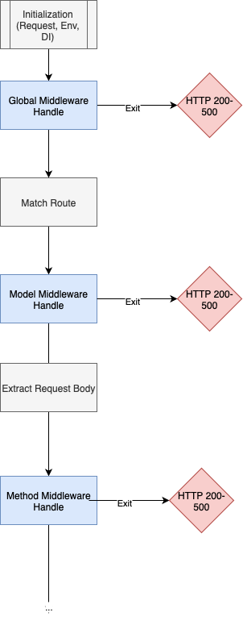

# Thoughts on Authentication and ORM in v0.0.4

In the original [cloesce abstract](../../abstract.md), I talked about how role-based authentication is a common need in web development, and can be complicated or require a lot of boilerplate to set up. IntelliTect's Coalesce solves this by baking authentication directly into the library-- all endpoints are authenticated by default, and an injected `ClaimsPrinciple` is passed around to determine a `User`. While we could copy this functionality, I think a far less constraining approach would be to ensure all of the primitive tools to do authentication are exposed and easy to use.

Another area in the abstract I talked about was `CRUD` endpoints, and the boilerplate that comes with them. I'll also explore some solutions to generate CRUD methods, respecting our solution to authentication.

## Authentication

Let's work backwards and imagine a perfect API to create our own authentication, through means of middleware functions and dependency injection. We will look at JWT for this example.

```ts
import { app, ... } from "cloesce";

class WranglerEnv {
  db: D1Database;
  JWT_SECRET: string;
}

@D1
class User {
  @PrimaryKey
  id: number;
}

app.use((request: Request, env: WranglerEnv, di: InstanceRegistry) => {
  const authHeader = request.headers.get("Authorization");

  if (!authHeader || !authHeader.startsWith("Bearer ")) {
    return { ok: false, status: 403, message: "Missing bearer token" };
  }

  const token = authHeader.substring("Bearer ".length);

  try {
    const { payload } = await jwtVerify(token, env.JWT_SECRET); // given some jwtVerify func

    const userId = payload.userId;
    if (!userId) {
      return { ok: false, status: 403, message: "Invalid token payload" };
    }

    // Fetch the user from D1
    const result = await env.db
      .prepare("SELECT * FROM [User] WHERE id = ?")
      .bind(userId)
      .first();

    if (!result) {
      return { ok: false, status: 401, message: "User not found" };
    }

    // Inject
    di.set(User, result);
  } catch (err) {
    return { ok: false, status: 401, message: "Invalid or expired token" };
  }
});

// ...and now, we can use the user anywhere

@D1
class Foo {
    ...

    @GET
    someMethod(@Inject user: User) {...}
}
```

This approach will authenticate every endpoint in the app and allow us to inject the user who is calling it, should they exist. With our already implemented middleware, this setup is possible. However, to get what I can think of as full coverage on authentication, we need to also consider:

- Scoped authentication: global (covered in the example above), models, data sources, methods
- Granular custom middleware in all authentication scopes (ie, the user may be authenticated, but I'd like to put custom logic before the method call)

Let's imagine a frontend solution for this:

```ts
import { app, ... } from "cloesce";

class WranglerEnv {
  db: D1Database;
  JWT_SECRET: string;
}

enum UserPermissions {
    isAdmin = 0,
    canUseFoo = 1,
    canUseFooMethod = 2,
}

@D1
class User {
  @PrimaryKey
  id: number;
  permissions: Integer; // an integer bitmap

  hasPermissions(perms: UserPermissions[]) {
    // ... extract perm list from `this.permissions`, and compare
  }
}

app.use((request: Request, env: WranglerEnv, di: InstanceRegistry) => {
// ... same global auth as before
});

// Model level middleware
app.use(Foo, (u: User) => u.hasPermissions([UserPermissions.canUseFoo]));

// Method level middleware
app.use(Foo, Foo.someMethod, (u: User) => u.hasPermissions([UserPermissions.canUseFooMethod]));

@D1
class Foo {
    ...

    @GET
    someMethod(@Inject user: User): HttpResult<void> {
        // only reaches if user has permission `canUseFooMethod`, as well as `canUseFoo`
    }
}
```

Each middleware scope has different injection scopes as well. Global level middleware has the bare minimum: request, env and di (maybe we will even give runtime access to the AST). Model level middleware has the same injection scope as global, but with the added benefit of knowing exactly what kind of model the request is operating on. Finally, method scope middleware will have the full suite of parameters accepted by the method (ie, if methodA accepts the values x,y,z then middlewareA can inspect those values). Note that method scope middleware will not have the instance of the class, as hydration occurs afterwards. See the state tree below:



There can of course be multiple entries per scope of middleware, ie:

```ts
app.use(Foo, () => {...}); // A
app.use(Foo, () => {...}); // B
app.use(Foo, () => {...}); // C
```

Our standard will be to do FIFO, meaning it will be called `A,B,C` in the above example. Each state has the ability to exit, in which case the next state would not occur.

Note that middleware is not apart of the CIDL, and thus is handeled entirely by the runtime implementation.

## CRUD Primitives (ORM)

Models all implement their own API, but tend to share a common layer of logic:

- Create a model
- Read a model
- Update a model
- Delete a model

There are many ways to tackle a CRUD abstraction layer, but let's first define necessary primitives to interact with models (almost an ORM). These primitive will all be calls to the WASM runtime, which has the necessary metadata loaded in memory. Each method will yield SQL query strings for `D1`

### Creating

It's easy to imagine an API to create an object:

```ts
Query.create(Foo, { ...obj }); // => "INSERT INTO Foo values (?, ?, ?)..."
```

This gets more complicated when we introduce navigation properties. We would have to depth-first traverse the models navigation properties, inserting the records bottom up, ie:

```sql
-- Given A which composes B which composes C
INSERT INTO C ...
INSERT INTO B ...
INSERT INTO A ...
```

### Reading

We already implement the logic for reading a model through the generated SQL views.

```ts
Query.list(Foo, "default"); // => "SELECT * FROM [Foo.default]"
Query.get(Foo, 1, "default"); // => "SELECT * FROM [Foo.default] WHERE [Foo.id] = 1"
```

### Updating

Similiar to creating, we could imagine an api:

```ts
Query.update(Foo, "default", old, _new);
```

where `old` is the current model and `_new` is some `Partial<T>` of the old model. We would again traverse the models navigation properties depth first, updating every field that is included in `_new`, returning a `UPDATE` query.

### Deleting

By default, Cloesce does not allow deleting a model that has any withstanding foreign key relationships (`ON DELETE RESTRICT`). Unlike the other operations, it's far more ambigious what we should do here. Deleting bottom up causes some problems, like if `A` and `B` depend on `C`, and we want to delete `C`, do we delete `A, B, C`?

I think it would be best to _attempt_ deleting `C`, meaning we return the query capable of doing so, but when ran, there could be a SQL error.

Using a provided data source, we could also navigate through dependencies and delete those, though again, it could fail.

```ts
Query.delete(Foo, "default");
```

###

Given the CRUD primitives, let's imagine a frontend UI to generate CRUD endpoints:

```ts
@D1
@CRUD([Post(Foo.default), Get(Foo.default), List(Foo.default), Delete(Foo.default), Patch(Foo.default)])
class Foo {
    ...

    @DataSource
    static readonly default = {...}
}
```

Note that the values in the decorators are all dummy values (just like all of the other decorators we've made), the extractor will read off the TS AST and extract what we need from it.

I imagine we can make these endpoints `<model>/<id>/<CRUD op>` or `<model>/<CRUD op>`.

It will be up to the runtime to determine if the endpoint is a CRUD generated endpoint, and then call upon our primitives to return the value.

## Middleware for generated CRUD endpoints

CRUD endpoints, while generic, should still be intercepted by middleware. I think the simplest solution to this is allowing this syntax for middleware:

```ts
// Method level middleware -- CRUD
app.use(Foo, Crud.post, () => {...});
```

where `Crud` is some enum with `post, patch, get, list, delete`.
